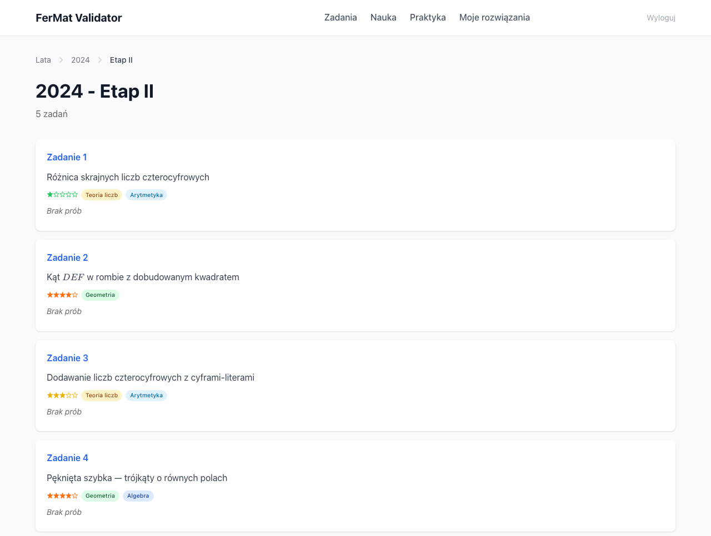
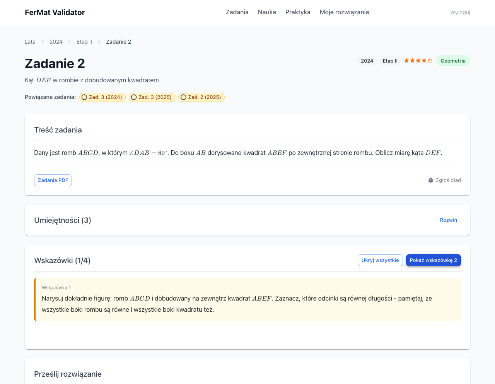
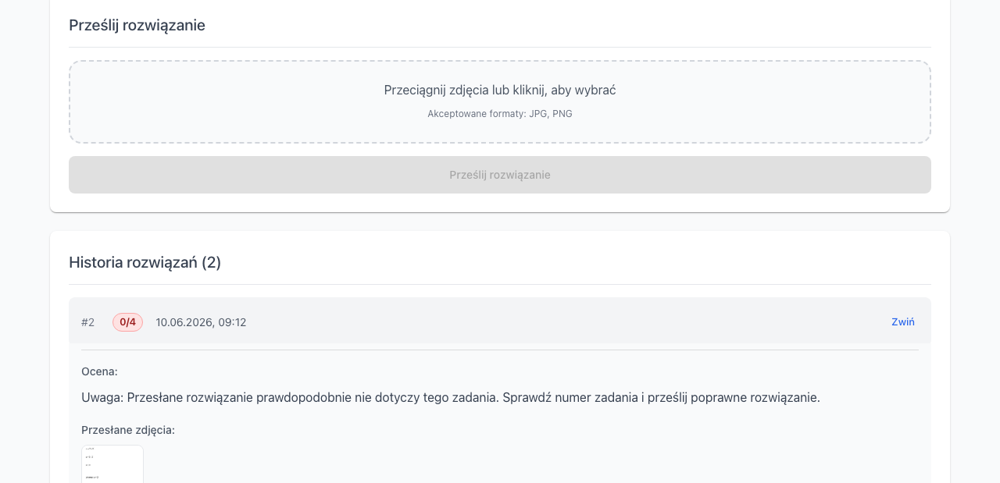

# FerMat Validator

Aplikacja webowa do sprawdzania rozwiązań zadań z Konkursu Matematycznego FerMat organizowanego przez SP 221 w Warszawie. Uczniowie mogą przesyłać zdjęcia swoich odręcznych rozwiązań, które są analizowane przez AI na podstawie oficjalnych zadań PDF i kryteriów oceniania.

## Zrzuty ekranu

| Lista zadań | Szczegóły zadania | Ocena rozwiązania |
|:-----------:|:-----------------:|:-----------------:|
|  |  |  |

## Funkcje

- Przeglądanie zadań FerMat z wielu edycji (etap1 i etap2)
- Przesyłanie odręcznych rozwiązań do oceny przez AI
- Punktacja konfigurowana przez YAML (`config/scoring.yml`)
- System progresywnych wskazówek pomagających w nauce
- Renderowanie LaTeX dla notacji matematycznej
- Metadane zadań: poziom trudności i kategorie

## Szybki start

```bash
# Zainstaluj zależności
pip install -r requirements.txt

# Skopiuj i skonfiguruj środowisko
cp .env.example .env
# Edytuj .env — ustaw GEMINI_API_KEY

# Uruchom serwer
./start.sh
```

## Konfiguracja

Zmienne środowiskowe (`.env`):

| Zmienna | Opis |
|---------|------|
| `GEMINI_API_KEY` | Klucz API Google Gemini do analizy rozwiązań |
| `GEMINI_MODEL` | Model do użycia (domyślnie: `gemini-2.0-flash`) |
| `AI_PROVIDER` | Dostawca AI (obecnie tylko `gemini`) |

Konfiguracja punktacji (`config/scoring.yml`):

```yaml
etap1:
  task_groups:
    - tasks: [1, 2, 3, 4, 5]
      max_points: 2
    - tasks: [6, 7, 8, 9, 10]
      max_points: 4

etap2:
  task_groups:
    - tasks: [1, 2, 3, 4, 5]
      max_points: 2
    - tasks: [6, 7, 8, 9, 10]
      max_points: 4
```

## Pobieranie zadań

```bash
# Pobierz zadania FerMat ze sp221.edu.pl
python download_fermat.py --dry-run   # podgląd bez pobierania
python download_fermat.py             # pobierz wszystkie edycje
python download_fermat.py --year 2024 # pobierz konkretny rok
```

## Źródła materiałów

Projekt wykorzystuje materiały konkursowe **Konkursu Matematycznego FerMat**.

- **Organizator**: [SP 221 – Szkoła Podstawowa nr 221 w Warszawie](https://sp221.edu.pl)

Zadania konkursowe (pliki PDF w katalogu `tasks/`) są własnością SP 221. Materiały są udostępniane w celach edukacyjnych.

**Ten projekt jest niezależnym narzędziem edukacyjnym i nie jest oficjalnie powiązany z organizatorem.**

## Licencja

Licencja MIT — szczegóły w pliku [LICENSE](LICENSE).
